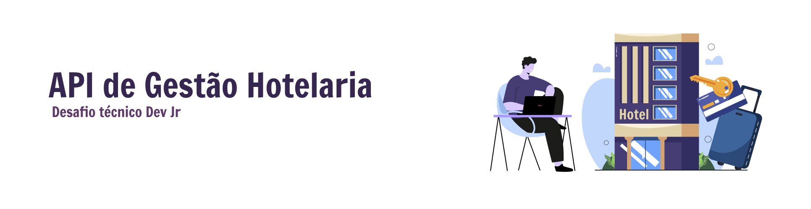
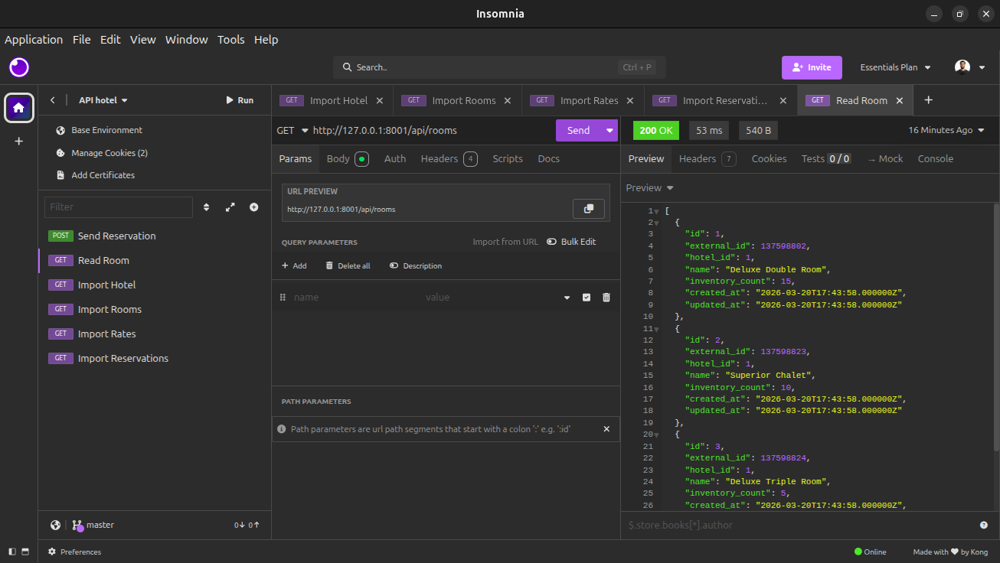
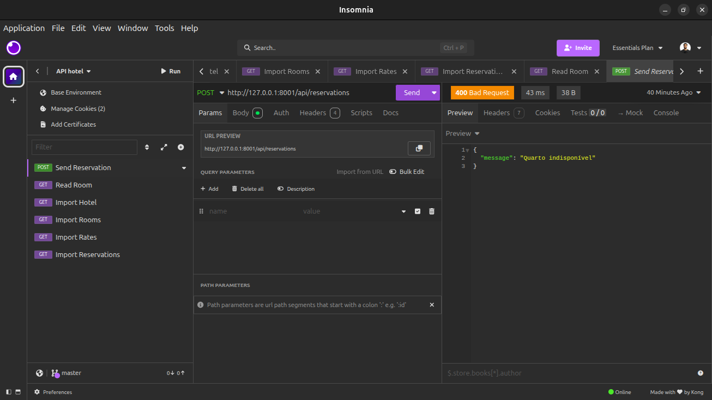
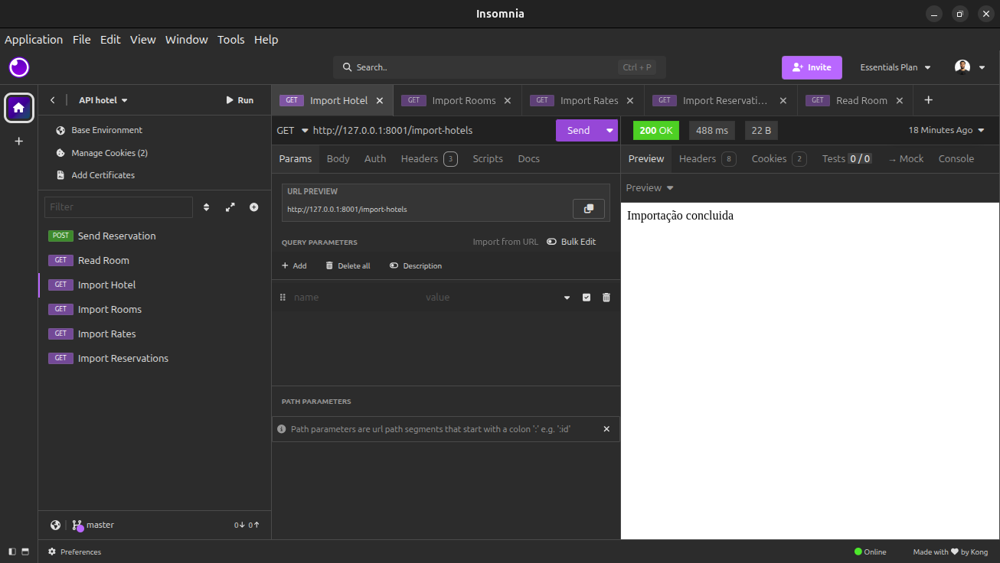

Este projeto foi desenvolvido como desafio técnico para criar uma API capaz de **importar dados de XML e gerenciar hotéis, quartos, tarifas e reservas**.

O objetivo era demonstrar capacidade de construir uma aplicação **do zero** com PHP e Laravel, aplicando padrões como **Service Layer**, e implementando **validações de disponibilidade de quartos**.

### 🛠️ Funcionalidades

1. **Importação de XMLs**
    - `/import-hotels` → importa hotéis do arquivo `hotels.xml`.
    - `/import-rooms` → importa quartos do arquivo `rooms.xml`.
    - `/import-rates` → importa tarifas do arquivo `rates.xml`.
    - `/import-reservations` → importa reservas do arquivo `reservations.xml`.

2. **CRUD básico**
    - Criação, listagem e visualização de **hotéis, quartos, tarifas e reservas** via API.
    - Para simplificação, neste desafio **edição e exclusão estão limitadas**, mas a estrutura permite fácil expansão.

3. **Validação de disponibilidade**
    - Antes de criar uma reserva via API, o sistema verifica se o quarto está disponível no período solicitado.
    - Evita sobreposição de reservas.

4. **Armazenamento de dados importantes**
    - `external_id` → mantém o ID original do XML para referência.

### 🗃️ Estrutura do Projeto

```text
app/
├─ Http/
│  └─ Controllers/
│     ├─ ImportController.php
│     └─ ReservationController.php
├─ Models/
│  ├─ Hotel.php
│  ├─ Room.php
│  ├─ Rate.php
│  └─ Reservation.php
├─ Services/
│  └─ ReservationService.php
database/
├─ migrations/
└─ database.sqlite
routes/
├─ api.php
```

### 🗒️ Descrição

**Controllers:** recebem requisições HTTP e delegam a lógica para Services.

**Models:** representam tabelas do banco de dados.

**Services:** contêm a lógica de negócio, como validação de disponibilidade de quartos.

**Migrations:** definem a estrutura do banco SQLite.

**Routes/api.php:** define as rotas públicas da API.

### 🦺 Como testar

Clonar o repositório:

```
git clone <URL_DO_SEU_REPO>
cd api-hotel
```

Instalar dependências:

```
composer install
```

Criar banco de dados:

```
touch database/database.sqlite
php artisan migrate:fresh
```

Rodar servidor:

```
php artisan serve
```

Importar dados XML:

```
GET /import-hotels
GET /import-rooms
GET /import-rates
GET /import-reservations
```

Consultar dados via API:

```
GET /api/hotels
GET /api/rooms
GET /api/rates
GET /api/reservations
```

Testar validação de reservas:

```
POST /api/reservations

```

```
Body JSON:
{
"room_id": 1,
"checkin": "2026-04-10",
"checkout": "2026-04-12",
"first_name": "Doni",
"last_name": "Silva",
"total_price": 300
}
```

Se o quarto estiver ocupado, a API retorna _"Quarto indisponível"_.

### 🟣 Alguns testes no Insomnia







### ⚠️ Observações

**XML de entrada:** fornecido pelo desafio (hotels.xml, rooms.xml, rates.xml, reservations.xml).

**Banco:** SQLite (por simplicidade e portabilidade).

**Validação de disponibilidade:** implementada no ReservationService.php.

**Decisões de design:**

Usei **external_id** para manter referência do XML.

Padrão **Service Layer** para separar lógica de negócio do Controller.

### ✒️ Aprendizado e justificativa

Apesar de não ter experiência prévia com Laravel, consegui:

- Instalar e configurar Laravel + Composer + SQLite.

- Entender migrations, models, controllers, services e rotas.

- Ler e importar XMLs para o banco de dados.

- Criar validação de disponibilidade de quartos.

- Testar rotas via Insomnia/Postman.

Nesse projeto busco demonstra capacidade de resolver um problema real mesmo aprendendo a tecnologia do zero.
